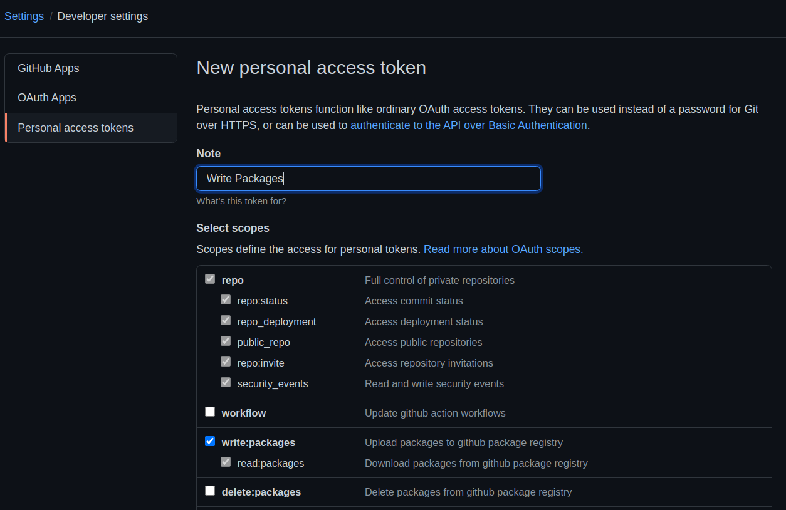
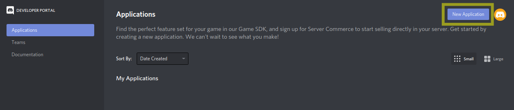
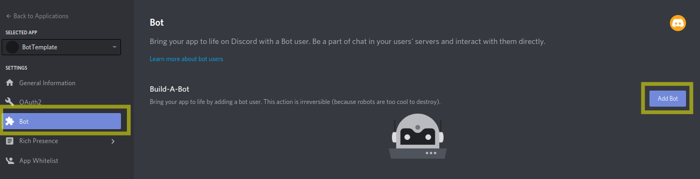
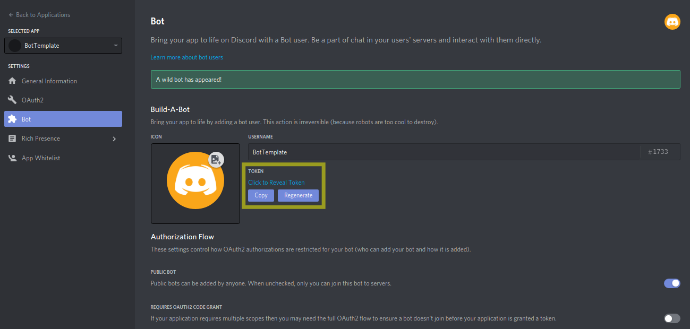
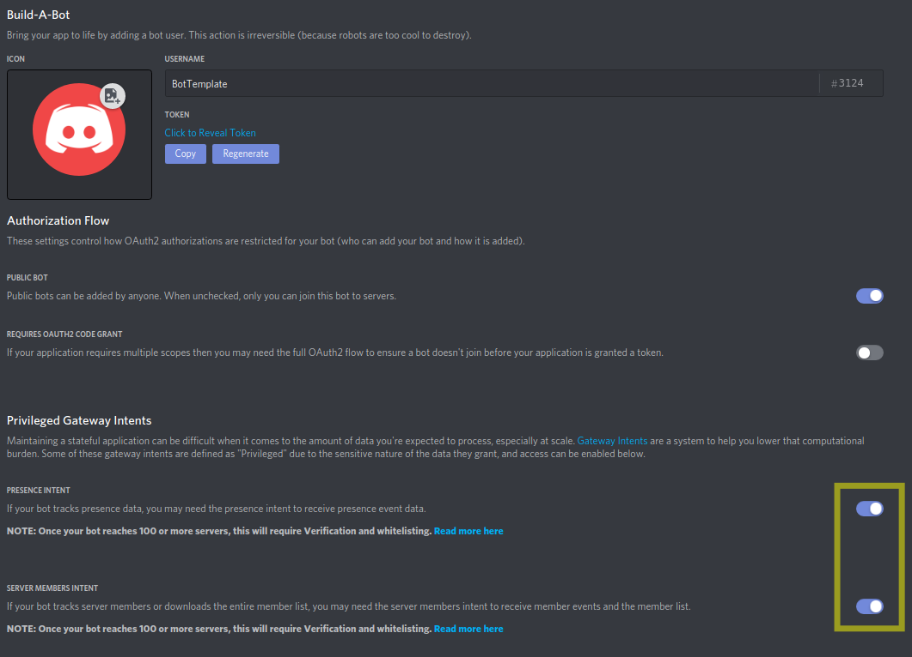
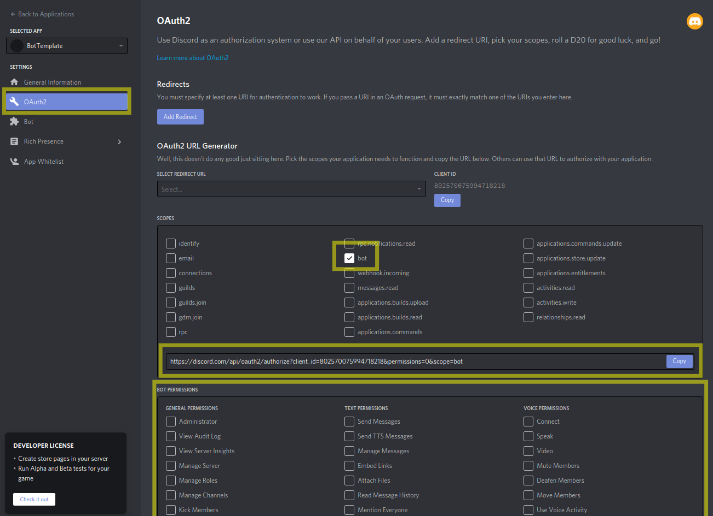

# Python Discord Bot Template
This template has been created for easy development and deployment of python discord bots.
It's completely based on [`defelo/morpheushelper`](https://github.com/defelo/morpheushelper)!  

If you're using this template don't forget to add a personal access token with the privileges to write packages in your repository secrets (`GH_PAT_PACKAGES`):

You can generate this access token in your github account settings (Settings -> Developer settings -> Personal Access Tokens -> Generate new Token):

## Acquire a bot token
1. Open the [Discord Developer Portal](https://discord.com/developers)
2. Click on the 'New Application' button and give the bot a name:
   
3. Now open the Bot settings:
   
4. Copy your bot token:
   
5. Don't forget to enable `Privileged Gateway Intents` (right below the `Authorization Flows` in the bot settings):
   
6. Add the bot to your discord server
   